# Kdrama-Movies-Analytics
**Programming for Data Science and Visualization – Assignment 1 Student Name: Tran Nguyen Hanh Nguyen**

**Student ID: 220184**

**Source:[ Kaggle](https://www.kaggle.com/datasets/chanoncharuchinda/korean-drama-2015-23-actor-and-reviewmydramalist/data)**

**Domain:** Arts and Entertainment/ Movies and TV Shows

**Table of Contents:**

1. [Introduction:](#_page0_x72.00_y588.52)
1. [Observation:](#_page1_x72.00_y209.05)

[Part I: Evolution Over the Years (2015-2023)](#_page1_x72.00_y236.05)

1. [Number of KDramas in a year](#_page1_x72.00_y259.67)
1. [Average duration of an episode and Average number of episodes in a film](#_page2_x72.00_y50.55)
1. [Number of films by Content Rating](#_page2_x72.00_y470.88)
1. [Streaming Platforms Evolution](#_page3_x72.00_y180.48)

[Part II: Ranking and Popularity Ranking](#_page4_x72.00_y89.92)

1. [Correlation between ranking and popularity ranking](#_page4_x72.00_y113.55)
1. [Boxplots of Ranking and Popularity Ranking by Content Rating categories](#_page5_x72.00_y50.55)
1. [Top KDramas with the highest ranking and popularity ranking](#_page5_x72.00_y531.45)
1. [Top 10 in each feature concerning Ranking and Popularity Ranking](#_page6_x72.00_y483.76)
- [Main Cast](#_page6_x72.00_y504.01)
- [Screenwriters and Directors](#_page7_x72.00_y161.92)
- [Air Dates and Networks](#_page8_x72.00_y50.55)
3. [Conclusion:](#_page9_x72.00_y50.55)
1. **Introduction:**

Korean Drama (K-drama) and K-pop have been a lifelong source of fascination, capturing my interest since my secondary school years. The storytelling, performances, and music transcend cultures, making the Hallyu Wave a global phenomenon. As a fan, I've observed the changing landscape of K-drama trends. To validate my perceptions with data, I embarked on this data analysis project, marrying my passion with data science.

Our dataset, comprising 1752 Korean films from 2015 to 2023, sourced from MyDramaList.com, provides a unique opportunity to explore K-drama comprehensively. This dataset includes standard film attributes (Year, Director, Screenwriter, Episodes, Duration, Air Dates, Network, Content Rating, and Synopsis) as well as valuable metrics like Ranking, Popularity Ranking, and main role actors/actresses.

Throughout this report, we'll navigate the Korean drama world, examining changes over the years, identifying industry influencers, and unveiling insights. We aim to both verify my perceptions and deepen our understanding of the dynamic K-drama landscape, shedding light on this compelling segment of the entertainment industry.

2. **Observation:**

**Part I: Evolution Over the Years (2015-2023)**

1. **Number of KDramas in a year**

Our journey into the world of Korean dramas begins by examining the annual release trends from 2015 to 2023. An intriguing observation is that the number of Korean dramas has surged by over 50% during this period, with a consistent annual increase of approximately 7%. In 2021, the count reached its zenith, with over 225 dramas released, indicating a fervent appetite for K-dramas.

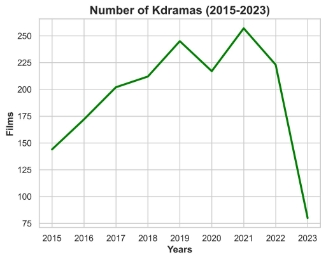

**Figure 1. Annual number of Korean Dramas**

Possible explanations for this remarkable surge include the growing global popularity of Korean dramas, propelled by the Korean Wave culture, as well as increased investments from domestic and international production companies. This upsurge is not only a testament to the growing demand for Korean dramas worldwide but also signifies a diverse array of offerings for viewers, catering to their interests.

2. **Average duration of an episode and Average number of episodes in a film**

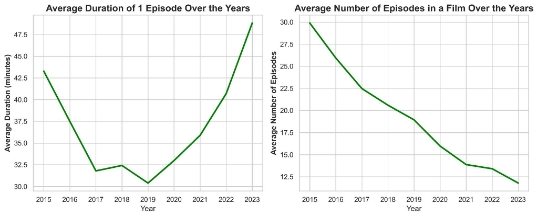

**Figure 2. Average Duration of an episode and Number of episodes in a film**

Next, we delve into the duration of episodes and the number of episodes in Korean dramas over the years. The data shows a slight increase in the average duration of an episode, from 43 minutes in 2015 to 49 minutes in 2023. But during this period, there was a sharp decrease from 2015-2019 to the lowest level, then recovered and grew again until 2023 and peaked at about 48.5 minutes. Simultaneously, there's a significant reduction in the average number of episodes, plummeting from 30 in 2015 to just 12 in 2023. This reduction correlates with the increase in episode duration, suggesting a trade-off between these two features.

A weak inverse relationship is observed between episode duration and the number of episodes, indicating that as episodes become longer, their number tends to decrease. This trend may be attributed to the growing popularity of streaming platforms like Netflix and Viki, which favor shorter, binge-worthy dramas. Additionally, production companies might be reducing the length of dramas to manage production costs or to cater to international audiences accustomed to shorter episodes in Western TV shows.

3. **Number of films by Content Rating**

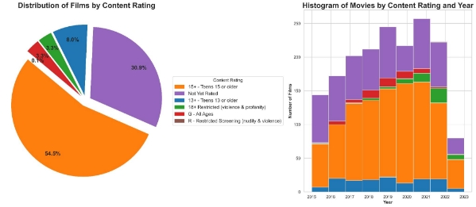

**Figure 3. Film distribution by Content Rating**

Our analysis of content ratings reveals that the most favored category is '15+ - Teens 15 or older,' followed by '13+ - Teens 13 or older.' The least popular category, 'R-Restricted Screening (nudity & violence),' maintains a consistently low count over the years. Notably, '18+ Restricted (violence and profanity)' dramas have seen a steady growth from 2017 onwards.

This trend suggests that the Korean drama industry increasingly focuses on producing content for a teen and young adult audience, possibly driven by the global fascination with Korean school dramas and the presence of Korean dramas on streaming platforms.

4. **Streaming Platforms Evolution**

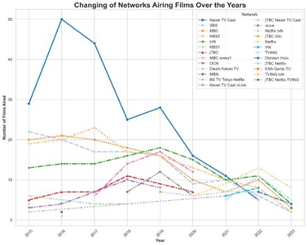

**Figure 4. Changing of Networks airing films**

The evolving landscape of streaming networks is evident. Netflix, TVING, and Viki lead the pack in terms of Korean drama releases. However, while Netflix and Viki continue to grow, Naver TV cast, once a significant player, shows a decline in recent years.

This shift signifies that the Korean drama industry is increasingly partnering with global streaming networks, in response to the growing popularity of streaming platforms worldwide. Notably, even domestic streaming networks like TVING and jTBC have seen significant increases in their offerings, indicating the industry's globalization and its ability to cater to both domestic and international audiences.

**Part II: Ranking and Popularity Ranking**

1. **Correlation between ranking and popularity ranking**

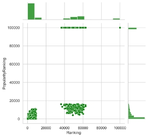 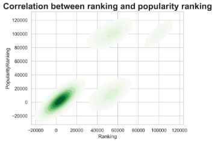

**Figure 5.1, 5.2. Correlation between ranking and popularity ranking**

The analysis of ranking and popularity ranking distributions reveals right-skewed patterns, indicating that a few dramas significantly impact the overall average.

The KDE (Kernel Density Estimation) plot between ranking and popularity ranking shows a negative correlation, with higher-ranking dramas tending to have lower popularity rankings and vice versa. This negative relationship suggests that critically acclaimed dramas may not always be the most popular among audiences, and popular dramas may not necessarily receive the highest critical acclaim. This could be due to factors like marketing, casting, or differences in audience demographics.

2. **Boxplots of Ranking and Popularity Ranking by Content Rating categories**

There is a clear distinction in the ranking and popularity ranking of Korean dramas based on their content rating categories. '15+ - Teens 15 or older' dramas tend to have higher rankings, but their popularity is relatively lower compared to 'G - All Ages' dramas, which are both highly ranked and popular. These findings may suggest that dramas targeting a younger audience receive higher critical acclaim, while those for all ages tend to be more popular.

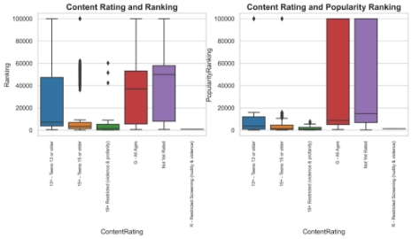

**Figure 6. Ranking and Popularity Ranking by Content Rating**

In addition, the relationship between popularity and ranking is not always straightforward. While '15+ - Teens 15 or older' dramas have higher rankings, they do not necessarily translate to higher popularity. This suggests that factors other than content and quality may influence a drama's overall popularity, such as marketing, lead actors, or audience demographics. In summary, the data suggests that content rating category plays a crucial role in the ranking and popularity of Korean dramas

3. **Top KDramas with the highest ranking and popularity ranking**

The top-ranked dramas encompass a mix of recent releases and classics, illustrating the timeless quality of Korean dramas. Some newer dramas like "Move to Heaven" and "Weak Hero Class 1" find their place among the highest-ranked, reflecting the industry's continued production of well-received content.

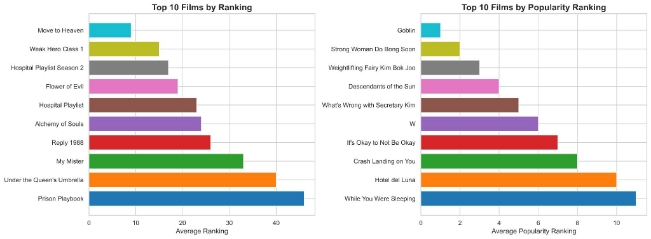

**Figure 7. Top 10 Films by Ranking and Popularity Ranking**

On the other hand, the highest-popularity-ranked dramas are predominantly from earlier years, indicating their enduring fan following. For instance, "Goblin" and "Strong Woman Do Bong Soon" maintain high popularity rankings, underscoring their sustained appeal.

By data handling, in terms of high-ranking films, the years 2020 and 2022 stand out with three films each in the top 10. This could indicate a strong period for the production of critically acclaimed dramas during those years. The year 2016 saw the highest number of high-popularity-ranking films, with ten of them making the top 10 list. This suggests that 2016 was a remarkable year for dramas that resonated with audiences.

The differences in the years of release between the high-ranking and high-popularity-ranking dramas suggest that some dramas have managed to maintain their popularity long after their initial release, while others are appreciated more for their recent quality and relevance.

4. **Top 10 in each feature concerning Ranking and Popularity Ranking**
- **Main Cast**

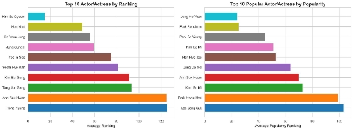

**Figure 8. Top 10 Cast by Ranking and Popularity Ranking**

From **Figure 8,** it is evident that the main role cast's popularity has an impact on the popularity ranking, but not necessarily on the ranking. While some actors and actresses appear in both lists, their order can differ significantly. This suggests that the main cast plays a more critical role in determining popularity.

However, the ranking might depend on other factors like story, script, direction, and more, rather than just the main cast.

- **Screenwriters and Directors**

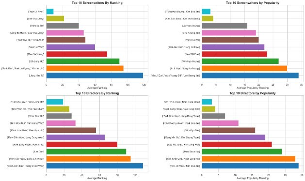

**Figure 9. Top 10 Screenwriters - Directors by Ranking and Popularity Ranking**

The screenwriter's influence on the ranking and popularity ranking is evident. In the ranking list, Yoon Ji Ryun, who holds the top spot, is a significant factor in determining a drama's success.

In the popularity ranking, screenwriters such as Yang Hee Seung and Kim Eun Sook also have a strong presence. This suggests that the quality of the script and storytelling can greatly impact a drama's popularity. The director also plays a significant role in determining the ranking and popularity ranking of a drama. Directors like Kim Chul Gyu and Yoon Jong Ho appear in both the top-ranking and top-popular lists, indicating their importance in creating successful dramas that are both good-quality and popular.

- **Air Dates and Networks**

The air date affects both ranking and popularity ranking. Dramas that air on weekends, such as Sundays and Saturdays, tend to perform well in terms of popularity. However, in the ranking list, air dates do not seem to have as much of an impact. The popularity ranking is more sensitive to air date, indicating that scheduling can affect a drama's reception among viewers.

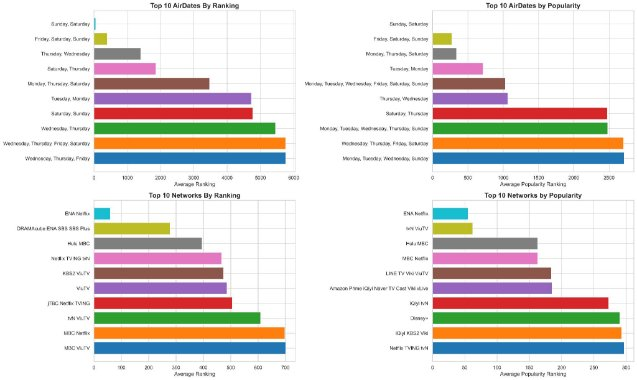

**Figure 10. Top 10 Air Date - Networks by Ranking and Popularity Ranking**

The network where a drama airs also plays a role in determining the ranking and popularity ranking. Netflix and tvN have a strong presence in both lists, highlighting their significance in Korean drama production and distribution.

The differences between the highest-ranking and highest-popularity-ranking dramas highlight the distinction between critical acclaim and audience engagement. High-ranking dramas may be recognized for their quality, storytelling, acting, and critical reception. These dramas are appreciated for their artistic and industry-related achievements. High-popularity-ranking dramas, on the other hand, are those that have captured the hearts of viewers and gained significant fan followings. These dramas may be popular for their engaging stories, characters, and viewer interactions, often driven by word of mouth and social media buzz.

In summary, while the main cast's popularity primarily affects a drama's popularity ranking, screenwriters and directors significantly impact both ranking and popularity ranking. Air date and network also play pivotal roles, with the former more sensitive to popularity ranking. The differing values between ranking and popularity showcase that a successful drama must combine critical acclaim, strong storytelling, popular actors, and effective marketing and scheduling.

3. **Conclusion:**

In conclusion, our journey through the world of Korean dramas has unveiled captivating trends and insights from 2015 to 2023. The K-drama industry has witnessed remarkable growth, with an over 50% increase in the number of dramas released, reflecting global demand and diverse offerings. The shifting landscape of episode duration and episode count underscores the industry's adaptability to streaming platforms and international viewers' preferences. The content rating analysis suggests a focus on teen and young adult audiences, driven by a worldwide fascination with Korean school dramas. The evolution of streaming networks indicates an increasingly globalized industry, accessible to viewers worldwide. Ranking and popularity ranking reveal the interplay between critical acclaim and audience engagement, emphasizing the multifaceted nature of a drama's success. Our examination of key industry influencers highlights the varying impacts of the main cast, screenwriters, directors, air dates, and networks on a drama's performance.

The Korean drama industry is a dynamic and multifaceted landscape, where success requires a delicate balance between critical acclaim and viewer engagement. Understanding these dynamics is pivotal for producing content that resonates with both critics and audiences. As a passionate admirer of Korean dramas, this project has not only validated my perceptions but also deepened our understanding of this compelling segment of the entertainment industry, reinforcing the enduring charm of the Hallyu Wave.
